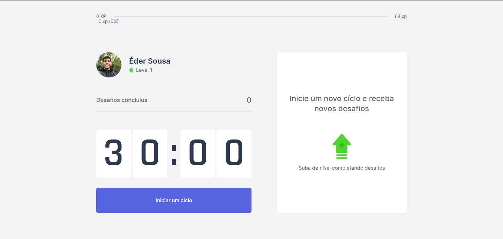
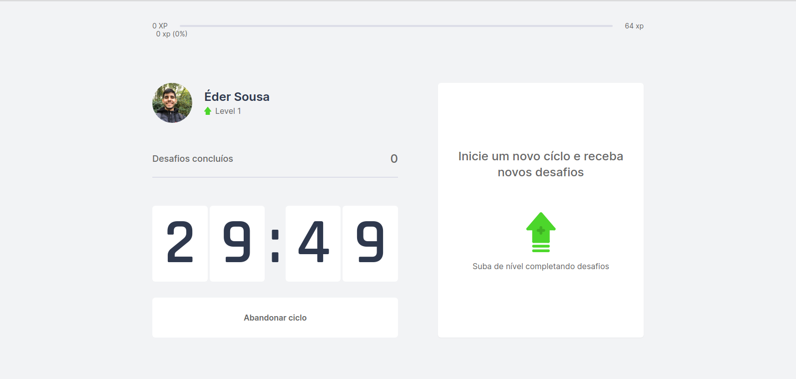
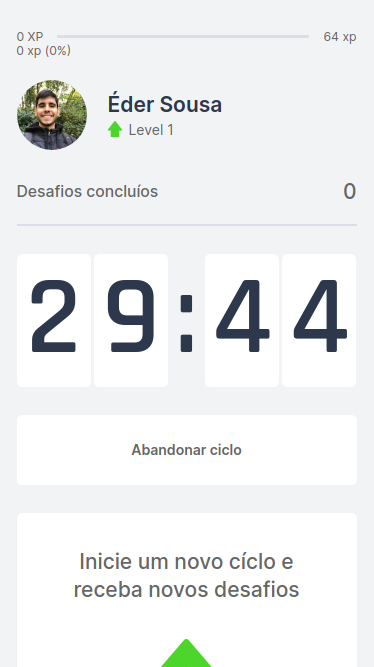

<p align="center">
  
</p>

Projeto construído durante a Nuxt Levue Week promovida no canal [Maiatto Dev](https://www.youtube.com/channel/UCWRzzG0D8OwMVu6FKKpHzIA).

# Movue It

Movue It é uma aplicação que permite executar a técnica Pomodoro para estimular o foco durante um dia de trabalho. Ao final de cada período, será proposto um desafio para que seja feita uma pausa para descanso e exercícios.

Move It é uma aplicação originalmente desenvolvida durante a Next Level Week, promovida pela [Rocketseat](https://rocketseat.com.br/) e adaptada para a tecnologia VueJs (com o framework [NuxtJs](https://nuxtjs.org/)) por [Rafael Maia Chieregatto](https://github.com/rafaelmaiach).

---

# Screenshots

### Início


### Tempo rodando


### Tempo rodando - Mobile
<p align="center">
  
</p>

---

# Tecnologias

Esse projeto foi desenvolvido utilizando [VueJs](https://vuejs.org/), [NuxtJs](https://nuxtjs.org/), [Typescript](https://www.typescriptlang.org/), [TailwindCSS](https://tailwindcss.com/) e o conceito de [Atomic Design](https://bradfrost.com/blog/post/atomic-web-design/). Com o objetivo de aprofundar meus conhecimentos.

---

# Executando o projeto

## Pré-requisitos

Antes de começar, é preciso ter instalado as ferramentas [Git](https://git-scm.com/), [Node.js](https://nodejs.org/en/) e um editor de código de sua preferência.

### Rodando a aplicação

```
  # Clone este repositório
  $ git clone https://github.com/ederwms/movueit.git
  
  # Acesse a pasta do projeto no terminal
  $ cd movueit
  
  # Instale as dependências
  $ yarn install (ou npm install)
  
  # Execute e aplicação em modo de desenvolvimento
  $ yarn dev (ou npm run dev)
  
  # Acesse http://localhost:3000
```

# Autor


[Éder Sousa](https://github.com/ederwms)

**&copy;** [MaiattoDev](https://www.youtube.com/watch?v=VbkFOWw4yeY&list=PL6GSB1I1APjqS1ligyQwHeVT0sAOWNkWH&ab_channel=MaiattoDev)

### Licença
[MIT](https://github.com/ederwms/movueit/blob/main/LICENSE)
